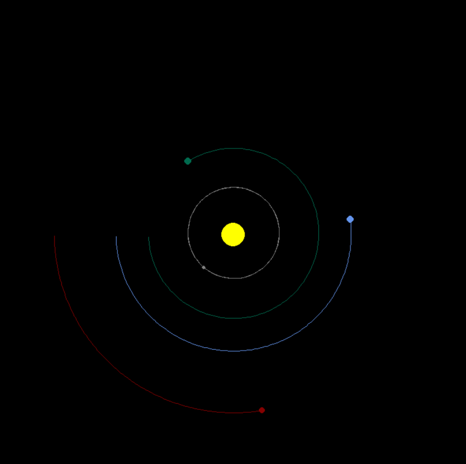

"# PlanetSim" 
A basic simulation of solar system orbits using Newtonian physics, the sum of gravitational forces of each body in the system. The scale of the planets’ radii is not accurate. It will export the sim's positon's data in a csv and parquet file after closing. Got this idea from Tech With Tim YT.  

